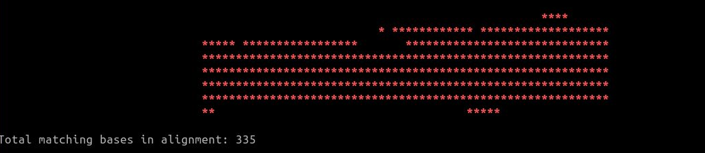
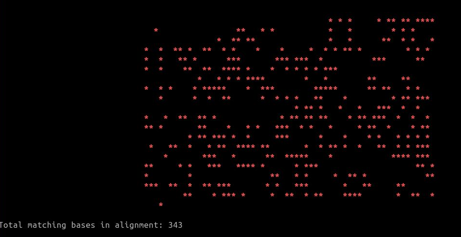

# Sanger Check
Quick-and-dirty sanger sequencing fragments checker - takes two (F&amp;R) fasta files, aligns them in clw format and outputs immediately relevant info. Meant for sanger sequenced 16s microbial barcoding results in 100s to low 1000s of base pair range.

Prerequisite is a muscle aligner available on the system - the script will assume 'muscle' command will call up the application, but you can just modify that part to point to whatever the alias already setup on the system.

Usage is about as simple as it gets:

```
sanger_check forward.fa reverse.fa 
```

The script will create a reverse complement of the second file passed as an argument, re-apply the original header and align it against the forward read using the muscle aligner.

Output is in two different forms- the first is the standard muscle alignment file saved in clw format, ending in .aln

The second output is a stdout to a the terminal, meant to immediately give the user a bird's eye view of the quality of the sanger result. Each of the red * denotes a matching base between the forward and the reverse read, with an actual count of matching bases given below the cli graph.





I'll also introduce an export feature for a combined forward and reverse read fasta file output. 
